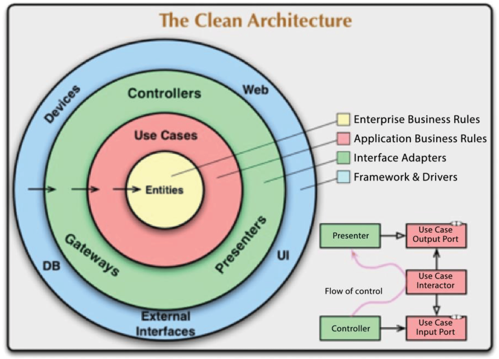
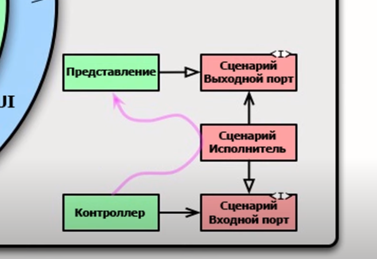
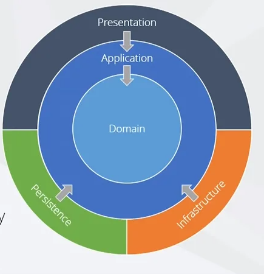
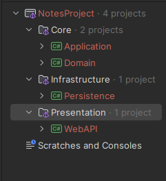
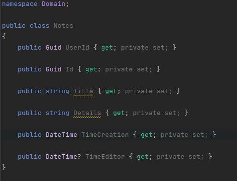

# Архитектура 

**Чистая  архитектура** - попытка объединить все лучшие архитектуры:

+ Независимость от фреймворка 
+ Тестируемость
+ Независимоть от **UI**
+ Независимость от **базы данных**
+ Независимость от какого либа внешнего сервиса 

### Диаграмма автора книги "Чистая Архитектура"

Мы будем разрабатывать сайт заметок и в нашем случае для каждого слоя будут выделены следующие задачи:
+ **Entities** (сущности)
    + Класс заметки(сущность, объект) ъранящий свойства заметки
+ **Use Cases** (используемые сценарии)
    + Создание, удаление, редактирование заметки
    + Нет привязки к базе данной - будет интерфейс
+ **Controllers, Gateways, Presenters** (Шлюзы, контроллеры, представления)
    + API контроллеры, работа с базой данных, работа с аунтефикацией 
+ **Framework and Drivers** (Фреймворк и драйвер)
    + Базы данных
    + Клиентское приложение 
  
### Схема работы архитектуры

### Диаграмма практического применения 

+ **Core** - Domain & Application
+ **Infrastructure** - Persistence(взаимодействие с базой данных)
+ **Presentation** - Web API

# Архитектура на деле или как выглядит шаблон моего проекта

Каждый слой иммет ссылку на слой ниже, кроме самого **Ядра** (Domain).

**Domain** хранит сущность `Notes`:

Остальные слой пока что хранят лишь ссылку на предыдущий слой.